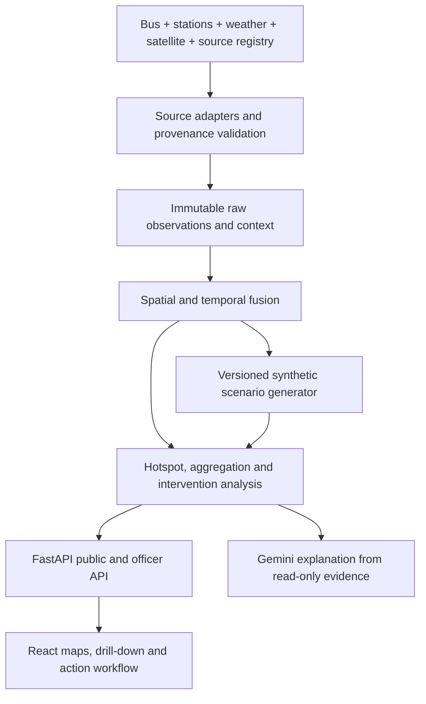
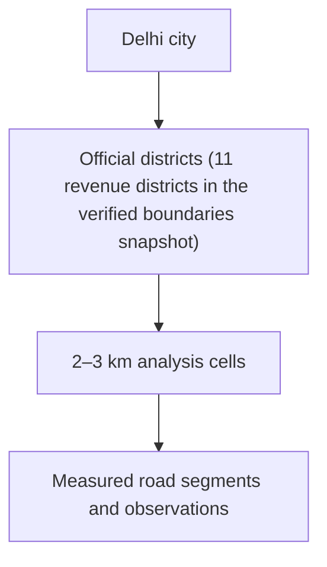

# Aerify AI: shared architecture (validated hybrid design)


**Revision:** 0.8 — geometry transport, CSV artifact delivery and read-only MCP tool layer; decisions locked 10 October 2026.


**Revision history:** 0.6-draft locked the execution decisions now expressed as the scope tiers and phases below; 0.7-draft removes person-based planning, adds the task execution order and change management, and folds in the route-entity change set: versioned routes co-planned with the 12 action zones, the Palam–Dwarka flagship proposal (confirmed at Gate 1 from the anchor-overlap table), the AirDelhi manifest row, the 11-district fix and the anchor-state wording guard; `schema_version` moves to `0.7-draft` with it, additively. 0.8-draft adds the geometry-transport decision (§4.8), the CSV/Cloud Storage artifact delivery path (§5), the read-only MCP tool layer over gold views (§12) and task rows 2.6/4.5; `schema_version` moves to `0.8` (additive: `GeometryTransport`/`GeoJSONGeometry` defs, embedded `geometry` on `ZoneVersion`/`RouteVersion`, `geometry_ref` demoted to a nullable server-side provenance pointer); from this revision forward, version strings drop the `-draft` suffix (prior revisions 0.6-draft/0.7-draft/0.8-draft kept their historical names).


## 1. Mission and scope


Aerify AI combines mobile particulate observations, public monitoring stations, weather models, satellite context and nearby-source geography to help officers identify Delhi pollution hotspots, compare interventions and communicate results to the public.


The demo uses a **hybrid evidence model**:


- Historical IIT Delhi bus observations provide real PM1, PM2.5, PM10, GPS and time where the archive has coverage.
- CPCB/DPCC stations provide official regional pollutant and AQI context where data access and reuse are verified.
- Weather APIs provide temperature, relative humidity, precipitation, wind speed and wind direction at the provider's model-grid resolution.
- Satellite products provide regional atmospheric context such as NO2, SO2 and aerosol indicators. A separate industrial-site or land-use registry identifies nearby factories; satellite pixels alone do not identify a factory or prove it caused a road reading.
- Team-recorded video or images illustrate the street scene at their true capture time. Cameras do not measure AQI and no Vision AI is used to verify an intervention.
- Missing local history and the post-action demo period are generated by a deterministic scenario engine. Every generated value is visibly marked **Synthetic demonstration**.
- As live bus, fixed, portable or public feeds become available, new records are stored as observed data. Synthetic records are never relabelled as observed later.


The flagship intervention is **water suppression on the Palam–Dwarka corridor**, with Anand Vihar ISBT retained as one of the other scenario actions. The flagship choice is confirmed at Gate 1 against the per-zone anchor-overlap table: a flagship zone with no verified observed anchors would make the demo's centrepiece fully synthetic. The untreated comparison area is selected after geographic and pre-trend review. The product evaluates PM2.5 and PM10 separately. It can show additional variables, but they do not become intervention evidence unless a valid source actually measured them.


## 2. Evidence rules


### 2.1 Data classes


| Class | Examples | Permitted claims |
| --- | --- | --- |
| `observed` | Bus PM reading, portable PM monitor, CPCB station | The named source measured this value at the recorded time and spatial support. |
| `modeled_context` | Weather API, air-quality model grid, satellite retrieval | The provider estimated or observed conditions for a grid/footprint; never call it a street measurement. |
| `synthetic_scenario` | Reconstructed local history, simulated post-action series, optional demo gases | A reproducible demo value produced by a named generator; never claim it occurred. |
| `derived` | District summary, 2–3 km cell aggregate, hotspot score, Indian AQI calculated from eligible inputs | A calculation from cited inputs and method version. |


Every numerical record carries `origin`, source/dataset ID, source time, ingestion time, spatial support, units, quality flags and method/generator version when applicable.


The API also exposes an evidence state: `DIRECTLY_OBSERVED`, `OBSERVED_NEARBY`, `MODEL_ESTIMATED`, `SYNTHETIC` or `INSUFFICIENT_EVIDENCE`. This describes the basis of the displayed value, not whether an intervention caused it. Intervention-effect status is a separate field.


### 2.2 Time alignment


Historical PM should be joined to **historical** weather and satellite data for the same period whenever those products are available. Current weather or satellite data may be used as a scenario template or model input, but it must not be backdated and presented as the weather or emissions state that existed during a historical bus trip.


For the demo, the generator may create a coherent past scenario from:


1. an observed historical PM2.5/PM10 anchor;
2. historical contextual data when available;
3. source geography and regional seasonal patterns;
4. explicit assumptions for missing variables; and
5. a fixed seed and generator version.


If only current context exists, label the result **Synthetic scenario conditioned on current context**, not reconstructed historical observation.


### 2.3 Pollutant priority


| Variable | Role |
| --- | --- |
| PM2.5 and PM10 | Required core observations, hotspot inputs and water-suppression evaluation variables. |
| PM1 | Display when measured by the bus or local sensor; supplemental context. |
| PM0.3 | Optional particle-count channel only when the device documents its unit and meaning. Do not store it as PM mass concentration. |
| Temperature, relative humidity, precipitation, wind speed/direction | Required context when available; retain model-grid resolution and provider. Humidity is also a low-cost PM sensor quality factor. |
| CO2, HCHO and TVOC | Optional context. Show only as measured, modeled by a suitable source, or synthetic. Do not infer them directly from PM2.5/PM10. |
| NO2, SO2, CO and O3 | Optional public-station or satellite/model context. Use source-specific units and spatial support. |


## 3. Logical system





### Component responsibilities


| Responsibility | Component |
| --- | --- |
| Raw source acquisition, licenses, units and spatial metadata | Source adapters + source manifest |
| Observed/context/synthetic separation | Backend provenance service and database constraints |
| Historical reconstruction and future scenario generation | Deterministic Python generator |
| District/cell/road summaries and freshness | Deterministic aggregation service |
| Intervention simulations and observed evaluation | Deterministic analysis worker |
| Narrative and source hypotheses | Gemini/ADK using validated read-only tools |
| Public/officer experience | React frontend using one generated API contract |


Gemini may explain or rank already computed evidence. It cannot fabricate measurements, produce the authoritative scenario series, change action state or assign a result status.


### Scope tiers


The demo core is the complete demonstrable product: provenance rules, audit trail, automated gates and every flow below. A capability may sit in **Optional extensions** only if it is an external scale/integration option and the demo core has a deterministic substitute. Nothing in the demo core may be silently dropped.


| Workstream | Demo core | Optional extensions; must not block the demo |
| --- | --- | --- |
| Frontend and public map | District → cell → road map, Near You fallback, provenance/coverage states, zone selection, intervention create/start/complete/media flow, checkpoint timeline, scenario/observed wording | Additional visual polish and nonessential optional-gas panels |
| Data and geography | AirDelhi import, immutable raw path, Delhi OSM/OSRM road pipeline, versioned segments, one-minute and 15/30/60-minute aggregates, 30-day/12-action generator, cached weather/satellite/facility context | Live hardware adapter and automated Earth Engine refresh; use documented snapshot adapters for the demo |
| Analysis and workflow | Frozen evaluation plan, reference checks, overlap detection, automatic confounder policy, paired scenarios, completion/+1/+3/+6/+12 checkpoints, virtual clock, deterministic narratives | Optional +24 h checkpoint and statistically adjusted causal model |
| Contract and platform | Schema/OpenAPI/types, complete officer/public/zone APIs, PostGIS migrations/seeds, Firebase roles, Cloud Tasks idempotency, CI drift gate, staging deployment | BigQuery analytical/AI mirror |


### Task execution order


The build follows workstreams, not assigned people. Anyone may pick up any task; the order and dependencies below are what the team executes. Tasks within a phase run in parallel unless a dependency says otherwise. Every phase ends with a gate; the next phase's first tasks may start only when the gate passes.


**Phase 1 — Contract and policy freeze**


| # | Task | Workstream | Depends on |
| --- | --- | --- | --- |
| 1.1 | Land `contracts/domain.schema.json`, OpenAPI generation and accepted fixtures | Contract/platform | — |
| 1.2 | Land road policy (`delhi_osm_250m_v1`, matching thresholds) and evaluation policy (`water_suppression_demo_policy_v1`, overlap policy) as versioned documents | Data/geography + analysis | — |
| 1.3 | Stand up CI skeleton with the contract drift gate | Contract/platform | 1.1 |
| 1.4 | Generate deterministic seed fixtures for roads and evaluation cases | Data/geography + analysis | 1.1, 1.2 |
| 1.5 | Verify IIT Delhi archive coverage over candidate zones and compute the per-zone anchor-overlap table (verified anchors × zone) | Data/geography | — |
| 1.6 | Joint route/action-zone plan: one artifact choosing the 6–8 synthetic corridors and the 12 action zones together so every action and reference zone sits on a route, consuming the 1.5 table and confirming the flagship zone | Data/geography + analysis | 1.5 |


**Gate 1:** schema/OpenAPI/fixtures green in CI; policy versions accepted; joint route/zone plan confirmed — every action and reference zone has route coverage, and the flagship zone has verified observed anchors.


**Phase 2 — Data foundation**


| # | Task | Workstream | Depends on |
| --- | --- | --- | --- |
| 2.1 | Empty-schema Alembic migration + deterministic seed against `aerify_ci` Cloud SQL/PostGIS | Contract/platform | Gate 1 |
| 2.2 | Load zone/road graph and district/cell geography into PostGIS | Data/geography | Gate 1 |
| 2.3 | Import pinned Geofabrik OSM snapshot, clip Delhi, run self-hosted OSRM matching, build `delhi_osm_250m_v1` | Data/geography | 2.2 |
| 2.4 | Source adapters: IIT Delhi bus, CPCB/DPCC candidate, weather, satellite, facility registry with provenance and snapshot metadata | Data/geography | 2.1 |
| 2.5 | Immutable raw payload storage path | Data/geography | 2.1 |
| 2.6 | Generate static geometry bundles (districts/cells/measured roads) with sha256 + version in the artifact manifest; serve with immutable caching | Data/geography | 2.2 |


**Gate 2:** migrated/seeded database; road graph and matched segments queryable; adapters ingest with full provenance.


**Phase 3 — Engine and analysis core**


| # | Task | Workstream | Depends on |
| --- | --- | --- | --- |
| 3.1 | Deterministic 30-day/12-action scenario generator with paired branches and the overlap case | Data/geography | 2.4, 2.5 |
| 3.2 | One-minute and 15/30/60-minute aggregation service with freshness/coverage gates | Data/geography | 2.3 |
| 3.3 | Evaluation-plan freeze, reference selection, overlap detection, confounder policy, scenario projections | Analysis | Gate 1 |
| 3.4 | Checkpoint evaluation jobs, server ClockService, idempotent task queue | Analysis | 3.3 |
| 3.5 | Hotspot scoring and derived aggregates | Analysis | 3.2 |


**Gate 3:** generator reproduces identical output from the same seed/snapshot; overlap case produces confounded/inconclusive; clock and checkpoints pass backend tests.


**Phase 4 — APIs and frontend**


| # | Task | Workstream | Depends on |
| --- | --- | --- | --- |
| 4.1 | Public/officer/supervisor/zone APIs against the generated client | Contract/platform | Gate 3 |
| 4.2 | District/cell/road map, Near You, provenance/coverage/no-data states | Frontend | 4.1 |
| 4.3 | Officer draft/start/complete/media flow and zone catalog | Frontend | 4.1 |
| 4.4 | Context drawer (weather/satellite/sources), scenario pages with lineage, checkpoint timeline, correction notice | Frontend | 4.1, 3.4 |
| 4.5 | MCP Toolbox on Cloud Run: read-only tools over gold views, SELECT-only role, ADK/Gemini wiring | Contract/platform | 2.1 |


**Gate 4:** full integrated flow — map → hotspot → frozen plan → action complete → checkpoints → public synthetic result — runs against the deployed API.


**Phase 5 — Hardening and demo**


| # | Task | Workstream | Depends on |
| --- | --- | --- | --- |
| 5.1 | Delayed checkpoints/catch-up, supervisor correction/recompute | Analysis | Gate 4 |
| 5.2 | Provenance drawers, public intervention timeline, evidence-state wording sweep | Frontend | Gate 4 |
| 5.3 | Staging deployment; full Playwright matrix; security/auth/idempotency/cache/clock verification | Contract/platform | Gate 4 |
| 5.4 | Defect fixing and reproducibility re-check | All | 5.1–5.3 |


**Gate 5 (demo readiness):** clean-seed rehearsal, reproducibility check, demo runbook and release tag; no new features after this point.


Parallelism: Phase 1 tasks 1.1/1.2 run together; Phase 2 runs 2.1/2.2 and 2.4/2.5 concurrently; Phase 3 runs 3.1–3.3 concurrently; Phase 4 runs 4.2–4.4 concurrently once 4.1 lands. Phases 2–4 overlap across workstreams as soon as each stream's own dependency chain clears.


### Architecture and contract change management


This document is the shared base that implementation branches from. Two independent version axes keep parallel work from breaking:


| Axis | Where it lives | Bumped when |
| --- | --- | --- |
| Architecture revision (`0.8` in the header) | This document | Any change to scope tiers, phases, policies, API surface, storage or evidence rules |
| `schema_version` (`0.8`) | `contracts/domain.schema.json` and every response's `schema_version` | Any DTO/field/enum change, however small |


Change flow:


1. Anyone may raise a change proposal against this document (PR or tracked issue) stating the motive, the affected sections and whether `schema_version` changes.
2. Accept the proposal by merging with a bumped architecture revision and, when DTOs change, a bumped `schema_version` plus updated fixtures, backend models/OpenAPI, generated TypeScript and both consumers in the same change.
3. Teams revise only what the change touches: a UI or API feature already building on the prior revision keeps working unless the merged change explicitly names its surface; consumers adapt to named changes at their own pace and never break the contract to match a stale local copy.
4. Additive optional fields may ship without a major bump but still require fixture and consumer updates; breaking enum or meaning changes require a schema version bump and a migration note in the revision history.
5. The repository copy of this document is always authoritative over any handoff copy, screenshot or fork.


Precedence within the repo: accepted decisions in `docs/data-and-schema-decisions.md` > JSON Schema/OpenAPI > this architecture document > role prompts and implementation details.


## 4. Data ingestion and fusion


### 4.1 Source adapters


1. **IIT Delhi bus archive:** ingest PM1, PM2.5, PM10, GPS and timestamps; preserve device IDs and CC BY attribution. It is historical playback, not a live feed.
2. **Live mobile or portable sensors:** optional future adapter for PM readings, GPS and sensor diagnostics. Calibrate/evaluate devices before treating their values as reliable public measurements.
3. **CPCB/DPCC:** ingest official station concentrations and AQI through an approved feed or documented import. A station remains a point/regional source.
4. **Weather:** obtain temperature, relative humidity, precipitation, wind speed and direction for requested coordinates and times. Persist the returned grid cell, nominal resolution and model.
5. **Satellite atmosphere:** ingest selected Sentinel-5P/CAMS layers with acquisition time, footprint/resolution, quality/cloud flags and pollutant product.
6. **Nearby sources:** maintain industrial facilities, industrial land-use polygons, major roads and construction/source candidates from a licensed registry. Store registry provenance and last update.
7. **Media:** record the original video/image capture time, GPS if available and a restricted media reference. Scenario time is separate.


Reference datasets inform the design but are not automatically mixed into Delhi values. AirDelhi is the Delhi seed source. Tokyo one-minute provisional data and Japan's hourly AEROS archive support the separation of sensor metadata, raw observations and validated aggregates. Copenhagen/Oakland mobile campaigns support map matching and repeated-pass aggregation; their concentrations must not be used as Delhi training values without a separate transfer/validation decision.


### 4.2 Collection, operational and display resolution


Collection frequency, analysis windows and map resolution are separate controls:


| Layer | Initial rule |
| --- | --- |
| Raw collection | Preserve the source frequency unchanged; ingestion must accept high-frequency mobile data (including about 3 seconds or 1 Hz). |
| Operational series | One-minute mobile aggregates for the demo and UI playback. |
| Comparison windows | Materialize 15-, 30- and 60-minute robust aggregates with counts, source counts and coverage. |
| Road support | Configurable 100–500 m segments for the prototype; shorter segments are allowed only when repeat coverage supports them. |
| City display | Combine eligible road aggregates into 2–3 km analysis cells, then districts. |
| Reporting | Derive hourly/daily summaries without discarding the finer records. |


A single passing reading is a direct observation at that place and time, but it is not sufficient evidence of a persistent hotspot. Stable road colouring requires repeated passes across configured time/day strata. Store unmatched points rather than silently snapping observations beyond the map-matching tolerance.


### 4.3 Spatial hierarchy





- Use official Delhi district polygons for the district view. The district count and membership come from the verified boundaries snapshot (Delhi has 11 revenue districts; older 9-district or 13/15-including-subdivision listings are not used). If the design groups districts into North/South/East/West style regions, call those product **zones**, not districts.
- Use stable H3/hex or square analysis cells sized approximately 2–3 km for drill-down. Cell size is configurable and is not a claim that every road was measured.
- Snap mobile observations to road segments for display and aggregate them within a limited time window.
- Mark cells and roads with no recent eligible observation as **No recent data**. Never fill them with an unlabeled synthetic or 11–45 km model value.


### 4.4 Routes as versioned entities — locked


Routes are first-class, versioned entities with the same immutability pattern as zones:


- `routes` gives stable identity; `route_versions` stores immutable geometry, purpose (`OBSERVED_TRACE` for real IIT Delhi archive traces, `SYNTHETIC_CORRIDOR` for generator-built corridors), source dataset, road network/segmentation versions and mapped device IDs, with a geometry hash. Playback and generator runs reference route version IDs, never mutable geometry.
- Real trace groups: historical IIT Delhi passes sharing a corridor are grouped into one observed route version each, preserving original device IDs and times. Route playback renders these groups.
- Synthetic corridors: the generator creates route versions for its virtual buses, declared as `SYNTHETIC_CORRIDOR`, and writes `route_version_ids` into every scenario run's lineage.
- A device maps to at most one active route version at a time; a route version's device list is part of its immutable content.
- Changing a route's geometry or device mapping creates a new version with a new ID; nothing is edited in place.


### 4.5 Road network and map matching — locked


- Source the demo road network from a dated OpenStreetMap Northern Zone/India PBF distributed by Geofabrik, clipped to the accepted Delhi boundary. Record URL, extraction timestamp, SHA-256, ODbL version and required OpenStreetMap attribution.
- Run a self-hosted, version-pinned OSRM Match service for timestamped mobile traces; do not depend on the public demo server. Pass recorded GPS accuracy where available. Reject observations with no match, match confidence below `0.50`, or snapped distance above `40 m`; keep them as unmatched raw points.
- Build directed road segments by splitting matched OSM ways at intersections and at a fixed maximum length of `250 m` for `segmentation_version=delhi_osm_250m_v1`. The displayed 100–500 m range is not retuned inside this version.
- A segment ID is a deterministic hash of `segmentation_version`, OSM way ID, direction and fractional start/end offsets. A new source snapshot or segmentation rule creates a new version and new IDs plus an explicit crosswalk; historical evaluations continue referencing their original version.
- Store `road_source_version`, `matching_method_version`, confidence, snapped distance and original coordinates with every match.


### 4.6 Nearby factory/source context


For a road or cell, query:


- nearby industrial facilities/industrial land use within 1 km;
- wider candidates within 3 km;
- wind direction and speed for the relevant regional grid/time; and
- satellite atmospheric indicators over their actual footprint.


Return ranked **possible source context** with distances and data times. Do not state that a factory caused the road-level PM spike without a separate source-attribution study.


Construction activity should come from an authoritative project/permit/source registry when possible. Satellite or imagery may provide coarse land-use/change context, but it does not reliably prove that a construction site was active at the event time.


### 4.8 Geometry transport — locked


Geometry reaches the UI through two transports, chosen per layer by size and reuse; a third is the documented scale path:


| Layer | Transport | Rules |
| --- | --- | --- |
| Districts, analysis cells, measured road segments | **Static, versioned GeoJSON bundles** | Generated in the same deterministic run that emits the demo CSVs (§5), with SHA-256 and version in the same manifest. Served from Cloud Storage with immutable caching. The road bundle contains only measured segments with eligible observations — unmeasured roads stay "No recent data" and are never drawn as valued. The serving version is exposed through the API so the UI can show "roads shown are from snapshot X". |
| Zones, routes, action polygons | **Embedded GeoJSON** in `ZoneVersion.geometry` / `RouteVersion.geometry` | Small features travel with the evidence so hash verification stays local: the client recomputes the geometry hash against `geometry_hash`. Keep polygons coarse (vertices minimized); the store-of-truth remains PostGIS. |
| Future scale path | Vector tiles (MVT) | Out of demo scope. When a city layer grows beyond what a bundle serves efficiently, add `ST_AsMVT` endpoints; bundle versions remain the identity anchor. |


`geometry_ref` on any DTO is a **server-side provenance pointer** (e.g. the PostGIS row the geometry was loaded from). It is nullable, never dereferenceable by a browser, and public responses strip or ignore it; the UI never fetches geometry through it. Every public geometry consumer reads `geometry` (`GeometryTransport`), which is `geojson`-encoded and hash-verifiable.


District linkage: the zone **entity** (`zones` table row) carries `district_id`, assigned at creation to the district containing the zone polygon's centroid (PostGIS `ST_Centroid`/`ST_Contains`). `GET /v1/public/zones?district_id=` filters on this field. Version rows stay immutable and gain no mutable linkage; a zone straddling district lines belongs to its centroid's district.


### 4.7 Immutable raw and calibration lineage


- Write source payloads to immutable, versioned object storage before normalization.
- Never overwrite a raw observation after calibration. Create a corrected/derived record linked by `raw_record_id`, `calibration_version`, calibration time range and quality flags.
- Reprocessing creates a new aggregate, AQI/sub-index or evaluation version; published versions remain auditable.
- Quarantine invalid units, impossible coordinates/timestamps and duplicates before they reach public aggregates.


## 5. Synthetic scenario engine


The generator is a backend module with a published configuration, fixed random seed and immutable version. Its output is stored separately from source observations.


### Generation pipeline


1. Select a real PM2.5/PM10 anchor series and retain its original identity.
2. Create a scenario clock and target action/reference zones.
3. Join time-compatible historical weather/satellite context when available; otherwise use explicitly labelled scenario assumptions.
4. Generate missing local action/reference PM series while preserving plausible relationships: PM10 must not be lower than PM2.5, shared regional trends affect both zones, weather/traffic/source effects are correlated, and missingness/quality flags are reproduced.
5. Add optional PM1, particle-count PM0.3, CO2, HCHO or TVOC only from a documented independent scenario model. Missing optional variables should remain missing when no defensible model is configured.
6. Generate the post-action counterfactual and comparison series for water suppression. Store the assumed effect, uncertainty and confounders as scenario inputs.
7. Validate ranges, units, timestamps, provenance, reproducibility and expected coverage. The computation determines the scenario result; fixtures do not hard-code a desired status.


### Demonstration dataset profile


- Generate 30 scenario days.
- Use hourly background/context for each 2–3 km cell and one-minute mobile observations for 4–6 virtual buses on 6–8 synthetic corridor route versions, about 16 operating hours/day. Six buses produce 172,800 one-minute rows over 30 days. Corridors are chosen jointly with the 12 action zones so every action and reference zone has route coverage.
- Add hourly weather for Delhi districts and optional 15-minute traffic context on selected roads. Weather remains grid/district context, not a road sensor reading.
- Create 12 action instances: three sustained improvements, three temporary improvements, three no-effect outcomes and three inconclusive/confounded outcomes.
- Make one of the three inconclusive/confounded cases an intentional overlapping-action contamination case.
- Ingestion accepts the higher-frequency AirDelhi-style stream, but the demo need not expand it to 3-second rows unless testing throughput.


For every synthetic intervention generate paired `WITHOUT_ACTION` and `WITH_ACTION` timelines with identical background, weather, traffic, route coverage and random disturbances. Only the versioned intervention-response function differs. Water suppression is first; its magnitude, onset and decay are configurable assumptions, never empirical claims.


Synthetic output must expose:


- `scenario_id`, `generator_version` and seed;
- observed anchor IDs;
- context source IDs and spatial resolution;
- assumptions and generated-variable list;
- `valid_time`, `generated_at` and quality flags; and
- a public label whose wording reflects the anchor state: **Synthetic demo — based on historical PM observations and contextual models** when verified observed anchors cover the zone, and **Fully synthetic demonstration — no verified observed anchors in this zone** when none do. The label is computed from the per-zone anchor-overlap table, never hardcoded.


### Demo artifact delivery — locked


The deterministic generator emits one versioned artifact family per scenario, written to immutable Cloud Storage before anything touches the database:


```
gs://<bucket>/aerify-demo/<family_version>/
 observations.csv        one-minute mobile PM (facts only; geometry as WKT)
 context_observations.csv  hourly weather/satellite/model context
 zones.csv / routes.csv  zone and route versions (geometry as WKT)
 geometry/
   districts.geojson     base-map bundle
   analysis_cells.geojson
   measured_roads.geojson  measured segments only
 manifest.json           sha256 + row count per file, generator_version, seed, source versions
```


- Geometry travels as WKT in CSVs and lands in PostGIS `geometry` columns during load; the GeoJSON bundles are generated from the same run and listed in the same manifest (§4.8).
- The Cloud SQL load **is** the deterministic seed (task 2.1): CI replays it from the manifest hashes to prove "same seed → identical artifacts".
- Raw payloads stay immutable; normalization never rewrites a published artifact — a new generator version writes a new `family_version` prefix.


## 6. Action and result model


An officer proposes an intervention and records `action_started_at`, `action_completed_at` and `marked_done_at`. Evaluation is anchored to completion; `marked_done_at` is audit time. Store UTC for computation plus the IANA timezone used for local display. Enforce `started <= completed <= marked_done` unless an audited correction workflow explicitly records why it differs. Media may document the scene, but it is not required and is not analysed to prove execution.


### Zone and workflow contract


- `zones` gives a stable identity; `zone_versions` stores immutable geometry, purpose (`ACTION`, `REFERENCE`, `DISPLAY`), source, effective time and geometry hash. Interventions reference version IDs, never mutable geometry.
- An officer with role `OFFICER` may create and edit a `DRAFT`, select action/reference zone versions, attach restricted media and submit/start the action. Starting is rejected unless an evaluation plan is frozen.
- `POST .../complete` accepts the officer-entered start/completion times and creates server `marked_done_at`, snapshot and due checkpoint jobs atomically.
- Before completion, the creating officer may correct draft/action times. After completion, only `SUPERVISOR` may submit an append-only correction with reason and replacement values.
- A correction creates a new intervention revision, preserves the former revision, supersedes affected snapshots/evaluations and enqueues idempotent recomputation. Published results remain queryable as superseded; the public view defaults to the latest effective revision and exposes a non-identifying correction notice.


### Frozen evaluation plan


Create the evaluation plan during proposal and freeze it at approval, always before `action_started_at`. The immutable plan contains action/reference zone versions, pre/post windows, checkpoints, coverage gates, thresholds, reference-selection evidence, road/matching/segmentation versions, overlap policy, confounder policy and method versions. The evaluator reads only this plan. Any later change requires the supervisor correction/revision path and re-runs every affected result; post-action values must never influence plan selection.


The backend captures the latest eligible action/reference PM and context records at or before `action_completed_at`, including source times and freshness. The full pre/post windows remain separate from this snapshot. If completion is entered late, the scheduler immediately runs all checkpoints whose event-time windows have already closed.


### Action Impact Evaluation Service


Checkpoint schedules are configured per action type. Water suppression defaults to completion, +1 h, +3 h, +6 h and +12 h, with optional +24 h. Each idempotent job recomputes eligible affected roads and containing cells from event time, not processing time, and writes pollutant-specific results. Production uses normal task scheduling; demo mode uses a virtual scenario clock or retroactive completion time; tests use an injected clock and never sleep for hours.


Two result paths must stay distinct:


| Result path | Inputs | Public wording |
| --- | --- | --- |
| `scenario_projection` | Any synthetic pre/post measurement series | **Simulated improvement**, **Simulated no measurable improvement**, **Confounded scenario** or **Insufficient scenario data** |
| `observed_evaluation` | Eligible observed pre/post PM in action and reference areas | **Observed improvement associated with the action**, **No measurable change**, **Confounded** or **Inconclusive** |


A scenario projection is useful for demonstrating the system and planning an intervention. It is not field verification. When actual future after-data exists, the system creates a separate observed evaluation rather than overwriting the scenario result.


For each pollutant P, the observed evaluation may use paired time-bin difference-in-differences:


`effect_P = (action_post_P - action_pre_P) - (reference_post_P - reference_pre_P)`


Store sample counts, independent bins, source count, interval, thresholds, method version, confounders and limitations. PM2.5 and PM10 can have different conclusions. AQI and camera media are excluded from this short-window impact calculation.


Select one or more reference areas using similar pre-action level/trend, road/land-use class, time-of-day coverage and weather exposure, while excluding the treatment radius. Store the selection method/version. If overlap or pre-trend checks fail, return `inconclusive` rather than manufacturing a counterfactual.


### Overlap and confounder policy


For each action, define an influence geometry from its action-zone geometry plus the action-type buffer and an influence interval from `action_started_at` through the final configured checkpoint. Before every evaluation, intersect it with all other non-cancelled action influence geometries/intervals:


- overlap with the treatment area marks affected bins `MULTI_ACTION_CONTAMINATION`;
- overlap with a reference zone marks the reference invalid;
- exclude contaminated bins; if the frozen minimum-bin/coverage gate then fails, return `confounded` or `inconclusive` and never an improvement status.


The demo does **not** fit weather-adjusted causal coefficients. It uses predeclared automatic exclusion/label rules, avoiding an unvalidated model trained on synthetic data. `water_suppression_demo_policy_v1` locks these gates:


| Trigger in action or reference comparison window | Automatic outcome |
| --- | --- |
| Coverage below 75% or fewer than three independent 15-minute bins | `INSUFFICIENT_EVIDENCE` / `inconclusive` |
| Rain rate ≥0.5 mm/h in two or more post-action 15-minute bins | `confounded` |
| Pre/post median wind-speed change ≥2 m/s or circular direction shift ≥45° | `confounded` |
| Action/reference traffic-index change differs by >0.20 on the normalized 0–1 scale | `confounded` |
| Treatment/reference overlap or another action contaminates required bins | `confounded`; `inconclusive` if usable bins fall below the gate |


Below-threshold weather/traffic changes remain disclosed, not statistically adjusted. These are fixed demo-policy values, not universal scientific thresholds. Publishing a real observed-effect association remains disabled until an environmental reviewer approves a production policy version.


### Authoritative clock


- Every environment injects one server-side `ClockService`: `REAL` in production/staging, `SCENARIO` in the public demo and `TEST` in automated tests.
- Demo clock state is deployment/scenario scoped and stored server-side (`scenario_id`, wall anchor, scenario anchor, speed, paused state, revision). Clients cannot override time through headers or query parameters.
- API responses include `clock_mode`, `effective_now`, `scenario_id` and `clock_revision`. The UI uses only this server time for freshness and “last updated.”
- Worker jobs store event-time due dates; the scheduler maps them through the same clock. Late completions immediately enqueue all due checkpoints.
- Cache keys include schema version, scenario ID, clock revision and effective time bucket. Changing/rewinding the demo clock increments its revision and invalidates prior cache namespaces.


## 7. AQI and pollutant derivation


- Ingest or generate concentrations; derive AQI/sub-indices from them. Never generate AQI independently.
- Compute pollutant sub-indices only for valid averaging windows and store the standard, algorithm version, averaging window and sufficiency decision.
- A regulatory-style CPCB overall AQI requires the CPCB sufficiency rules, including at least three qualifying pollutants, one of which is PM2.5 or PM10, and the required temporal coverage. The overall index is the maximum qualifying sub-index.
- With only PM2.5 and PM10, expose pollutant concentrations, their sub-indices and optionally `estimated_local_aqi`/`pm_based_air_quality_indicator`; never label it official or regulatory CPCB AQI.
- Official station AQI is displayed as received, with its source and time. It is not treated as a street measurement or used as the primary short-window action-effect outcome.


## 8. Public map and location experience


### City overview


- Display Delhi as a district choropleth or accessible tiled/hex map with PM2.5, PM10 or official AQI selection.
- Each district shows value, category, source type, last update, coverage and observed/modelled/synthetic badge.
- Selecting a district opens its 2–3 km cells; selecting a cell opens named areas and measured road segments.
- Highlight high values using the selected metric's published thresholds. Provide a legend and text category for colour-blind accessibility.
- Satellite, weather, official stations, mobile routes and possible-source layers can be toggled independently.


### “Near you” card


Use device location only with user permission. Show:


1. the nearest recent eligible road/bus observation, with distance and time;
2. the nearest official monitoring station AQI as a separate row;
3. modelled regional context if no observation is close enough; and
4. nearby-city official AQI cards.


Call a value **street-level** only when it comes from an eligible observation on or near that road within configured distance and freshness limits. Otherwise use wording such as **nearest road observation**, **nearest station** or **regional model estimate**. Fallback wording is parameterized by zone: the same per-zone anchor-overlap table that drives the synthetic label also decides which fallback rows a zone can honestly show, and a zone with no verified observed anchors never receives observation-grade wording.


### Map aggregation safeguards


- District/cell colours include a minimum coverage rule.
- A route reading expires after a configured freshness window.
- Aggregations use robust statistics and keep sample/source counts.
- Users can open provenance details for each value.
- Official Indian AQI is displayed only when received from an official source or calculated from eligible pollutant inputs using a declared Indian AQI method and averaging period.


## 9. Storage


Use three logical layers while keeping the prototype operationally simple:


| Layer | Prototype | Scale path |
| --- | --- | --- |
| Raw/bronze | Versioned Cloud Storage payloads partitioned by source/date/hour | Retain unchanged. |
| Operational/silver | Google Cloud SQL PostgreSQL/PostGIS normalized observations, context, map matching and quality state | Add an asynchronous BigQuery analytical mirror, partitioned by event date, when batch analytics or SQL-native AI are enabled. |
| Derived/gold | Google Cloud SQL PostgreSQL/PostGIS road windows, cells, AQI/sub-indices and evaluations | Materialize selected analytical tables in BigQuery; publish approved outputs back through the API. |
| Transactional | The same PostgreSQL database for actions, workflows, scenario configs and job state | Do not add Firestore unless a separate product need emerges. |


The 30-day six-bus demo is only 172,800 one-minute records, so moving the prototype's source of truth to BigQuery and splitting workflow state into Firestore would add complexity without a demonstrated capacity benefit. PostGIS is already required for frequent road/polygon/radius operations. BigQuery is nevertheless useful as an optional analytical/AI extension: scheduled SQL can create large temporal/geospatial summaries, and `AI.GENERATE`/structured generation can batch-create draft explanations or classify free text beside warehouse data. It is not on the synchronous map/API path and its LLM output is never authoritative evidence.


Suggested tables:


- `datasets`, `source_licenses`, `sensor_devices`
- `routes`, `route_versions`
- `observations`, `context_observations`, `satellite_observations`
- `facilities`, `source_geometries`, `administrative_areas`, `analysis_cells`, `road_network_versions`, `road_segments`, `road_segment_crosswalks`, `observation_road_matches`
- `scenario_definitions`, `scenario_runs`, `scenario_values`, `generation_lineage`
- `hotspots`, `map_aggregates`, `simulations`
- `zones`, `zone_versions`, `interventions`, `intervention_revisions`, `evaluation_plans`, `action_checkpoint_schedules`, `action_context_snapshots`
- `scenario_results`, `observed_evaluations`, `verification_pollutants`
- `camera_media`, `runtime_clocks`, `evaluation_jobs`, `audit_events`


Raw records are immutable. Derived aggregates and scenario outputs reference their complete input set or an immutable input snapshot. PostGIS performs point-in-district, cell and radius queries. BigQuery may be added when real history or scale justifies it.


Partition/index event-time tables by event date/time and source/device; add spatial indexes for geometry. Store `event_time` and `processed_at` separately throughout.


## 10. API changes


| HTTP | Purpose |
| --- | --- |
| `GET /v1/public/cities/delhi/overview?metric=&time=` | District map with coverage and provenance. |
| `GET /v1/public/districts/{id}/cells?metric=&time=` | 2–3 km cell drill-down. |
| `GET /v1/public/cells/{id}/roads?metric=&time=` | Measured roads/areas and freshness. |
| `GET /v1/public/nearby?lat=&lng=&radius_km=` | Nearest observation, station and nearby-city summaries. |
| `GET /v1/public/locations/{id}/context` | Weather, satellite and possible nearby sources. |
| `GET /v1/public/scenarios/{id}` | Synthetic demo timeline, lineage and projection. |
| `GET /v1/public/zones?purpose=&district_id=` | Public zone catalog; filters on the zone entity's `district_id` (§4.8); catalog DTO carries `district_id`. |
| `GET /v1/public/zones/{id}` | Zone metadata and versioned geometry (embedded `geometry`, hash-verifiable; §4.8). |
| `GET /v1/public/geometries?ids=...` | Batch geometry fetch for zones/routes by ID, as `GeometryTransport` (§4.8). |
| `GET /v1/public/interventions?zone_id=&status=&cursor=` | Paginated public intervention list. |
| `GET /v1/public/interventions/{id}` | Officer-reported action and any later observed evaluation. |
| `GET /v1/public/interventions/{id}/evaluations` | Completion and delayed checkpoints with evidence state and reference comparison. |
| `POST /v1/officer/interventions` | Create draft with action/reference zone versions and evaluation-plan draft. |
| `PATCH /v1/officer/interventions/{id}` | Edit draft metadata before start/completion lock. |
| `POST /v1/officer/interventions/{id}/start` | Freeze evaluation plan and record action start. |
| `POST /v1/officer/interventions/{id}/complete` | Record completion, server Mark Done, snapshot and checkpoint jobs atomically. |
| `POST /v1/officer/interventions/{id}/media` | Attach restricted contextual media metadata/object reference. |
| `POST /v1/supervisor/interventions/{id}/corrections` | Append audited correction, supersede affected results and re-run. |
| `POST /v1/internal/ingest/{source}` | Authenticated source ingestion. |
| `POST /v1/internal/scenarios/{id}/generate` | Idempotent deterministic generation; emits the CSV/GeoJSON artifact family and manifest (§5). |


Responses use one contract and include `schema_version`, `data`, `provenance`, `coverage`, `generated_at` and warnings as applicable. Public queries cannot enumerate private media or raw officer identities.


Mutating endpoints require an idempotency key and optimistic revision. Role checks are enforced by FastAPI, not UI visibility.


## 11. Runtime and security


- React + TypeScript + Vite frontend on Firebase Hosting.
- FastAPI on Cloud Run as the only operational API.
- Private Cloud Run worker invoked by OIDC-authenticated Cloud Tasks.
- Google Cloud SQL for PostgreSQL with the PostGIS extension is the only operational database in development, CI and demo.
- Firebase Auth for officer access; backend verifies tokens and database roles.
- Secret Manager for third-party API keys; ADC/workload identity for Google Cloud services.
- Cloud Storage for restricted media.
- Cache public aggregates and contextual API results by source time/resolution to control cost and rate limits.


### Development, staging and CI


- Do not install or run PostgreSQL/PostGIS locally and do not use Docker Compose for the database. For the hackathon, one small non-HA Cloud SQL instance may contain isolated `aerify_dev`, `aerify_ci` and `aerify_demo` databases with separate least-privilege roles. A real production deployment must use a separate instance/project boundary.
- Prefer a deployed development FastAPI service on Cloud Run. When the backend is run on a developer machine, it connects directly to `aerify_dev` through the Cloud SQL Python Connector with Application Default Credentials; no Cloud SQL Auth Proxy, static database password or unrestricted public-IP allowlist is required.
- Cloud Run API/worker connect through the Cloud SQL integration using a dedicated service account and IAM database authentication. Use private IP where the project network is configured, require encrypted connector traffic and place any bootstrap-only database credential in Secret Manager.
- Set a small SQLAlchemy pool (for example 2–5 connections per instance), no unnecessary minimum Cloud Run instances and a Cloud Run maximum-instance cap consistent with the Cloud SQL connection limit. Retry transient connection failures with bounded backoff; never retry a non-idempotent transaction blindly.
- Staging/demo uses separate Cloud Run API/worker, `aerify_demo` database, storage prefix/bucket, task queue and Firebase configuration. Synthetic seed/reset is allowed only in dev/CI/demo and is denied by role in any future production database.
- Alembic owns all schema migrations. CI authenticates through Workload Identity Federation plus the Cloud SQL connector, creates a unique empty schema in `aerify_ci`, enables no extensions dynamically, migrates/seeds/tests it and drops only that run's schema in an always-run cleanup step. PostGIS is pre-enabled by the controlled bootstrap migration.
- CI required checks: JSON/JSON-Schema fixtures; Alembic upgrade from an empty schema; backend format/type/unit/integration tests; OpenAPI generation; generated TypeScript client with a zero-diff assertion; frontend lint/unit/build; Playwright observed/modeled/synthetic/stale/no-data/officer/correction paths; container build; secret scan.
- Protect the integration branch: required checks and review must pass; changes to `contracts/`, migrations and generated clients require contract-steward review from whoever owns the contract/platform workstream at that time. Generated contract drift fails CI rather than being committed silently.


## 12. AI boundaries


Read-only tools may expose hotspot evidence, map coverage, weather context, satellite context, nearby-source candidates, scenario lineage, computed projections and observed evaluations. The agent may state hypotheses and limitations with source IDs. It cannot:


- convert satellite context into a factory-causation claim;
- convert a video into an AQI measurement;
- infer HCHO/TVOC/CO2 from PM without an approved model;
- turn synthetic values into observed evidence;
- confirm an officer action; or
- publish/change a numerical result.


If Gemini is unavailable, deterministic summaries remain available and the product continues to function.


### Read-only MCP tool layer — locked


Gemini/ADK reaches evidence through read-only MCP tools over governed SQL views, never raw tables. MCP Toolbox for Databases (googleapis/genai-toolbox) runs on Cloud Run with a Cloud SQL PostgreSQL source; ADK/Gemini consumes its tool surface.


- Governed **gold views** precompute `evidence_state`, coverage, provenance mix and the synthetic badge on every row, so no tool can serve an unmarked synthetic value.
- The MCP database role is `SELECT`-only on views: no base tables, no writes, no DDL. Officer writes (auth, idempotency, corrections) never pass through MCP; they remain FastAPI endpoints with database roles enforcing the boundary.
- Every tool response carries `schema_version`, provenance and the same evidence wording as the public API (§12 AI boundaries above apply to each tool verbatim).
- Tool surface (initial): `get_hotspot_evidence`, `get_map_coverage`, `get_context`, `get_scenario_lineage`, `get_evaluation_results`. Parameters are validated in the toolbox config; responses are size-capped.


### Optional BigQuery AI path


Use BigQuery AI only for asynchronous, reviewable enrichment such as batch draft hotspot narratives, clustering/classifying officer notes, anomaly-triage labels, or embeddings/search across reports. First reduce observations to compact, provenance-rich rows; do not send every sensor row to an LLM. Persist prompt/model/version/status/cost metadata and validate structured output before publishing. Deterministic SQL/Python remains responsible for AQI, concentrations, action effects, evidence states and alert thresholds. Direct Gemini calls from the service remain preferable for low-latency interactive explanations over a small evidence packet.


## 13. Delivery changes from the previous architecture


1. Add weather, satellite and nearby-source registry adapters to demo context ingestion.
2. Add spatial-support and temporal-support metadata to every record.
3. Add a versioned fusion and synthetic generation service with lineage.
4. Split scenario projections from observed intervention evaluations.
5. Add district → 2–3 km cell → measured-road APIs and UI.
6. Add a permission-based “Near you” card and nearby-city official AQI.
7. Expand the contract to optional PM1, particle-count PM0.3, CO2, HCHO and TVOC without making them required evidence.
8. Preserve raw collection cadence while adding one-minute, 15/30/60-minute and road/cell derived layers.
9. Add three action timestamps, event-time checkpoint scheduling and catch-up evaluation.
10. Add evidence-state and AQI-sufficiency contracts.
11. Generate 30-day paired scenario branches and 12 outcome cases with an injectable clock.
12. Add immutable raw object storage and calibration/version lineage; keep PostGIS for the prototype and allow an optional asynchronous BigQuery analytics/AI mirror.
13. Add PostGIS geometries, coverage/freshness rules and no-data states.
14. Move satellite from deferred scope into contextual MVP scope; retain live Earth Engine automation as optional if access or time is limited.
15. Update fixtures and prompts so synthetic data is never labelled verified impact.
16. Add immutable zones/evaluation plans, full officer/supervisor endpoints and re-versioning corrections.
17. Lock the OSM/Geofabrik → self-hosted OSRM map-matching pipeline and versioned segment IDs.
18. Add overlap contamination and automatic, versioned disclosure/exclusion gates.
19. Propagate a server-owned clock through API, UI, workers and caches.
20. Replace the local database topology with direct Google Cloud SQL PostgreSQL/PostGIS access, isolated dev/CI/demo databases, IAM/connector authentication, bounded connection pools and required CI contract-drift gates.
21. Add versioned `routes`/`route_versions` with observed-trace and synthetic-corridor purposes, and plan the 6–8 synthetic corridors jointly with the 12 action zones so every zone has route coverage.
22. Add the per-zone anchor-overlap table, confirm the flagship zone from it at Gate 1, and compute synthetic display wording and Near You fallback wording from the zone's verified anchor state.


## 14. Release gates


- JSON Schema validates observed, modeled, synthetic and derived examples.
- Same seed and source snapshot reproduce identical scenario output.
- Historical/current time mismatch is rejected or clearly flagged.
- Optional gases cannot be populated without source or approved generator lineage.
- District/cell/road aggregation honours freshness and minimum coverage.
- “Near you” falls back accurately when no street observation exists.
- Scenario projection and observed evaluation have different DTOs and UI wording.
- Satellite/factory context never produces a causal statement.
- Public UI exposes source, time, spatial resolution and synthetic badge.
- Officer auth, public redaction and task idempotency pass integration checks.
- AQI labels fail closed when pollutant or temporal sufficiency is unmet.
- Late Mark Done executes already-due checkpoint jobs using event time.
- Any BigQuery AI output is batch-only, reviewable and excluded from authoritative calculations.
- An action cannot start without a frozen pre-action evaluation plan and immutable zone versions.
- A completed action correction creates a new revision and superseded/recomputed evaluations.
- Overlap, weather, traffic and coverage fixtures exercise automatic policy outcomes.
- Map matching records network/segmentation/matcher versions and rejects low-confidence points.
- Every action and reference zone in the demo dataset sits on a route version; generator lineage records the route version IDs it used.
- A zone with zero verified observed anchors displays the fully-synthetic label and observation-grade wording is suppressed for it.
- API, worker, UI freshness and caches agree on the same server-provided effective time.
- OpenAPI → generated TypeScript produces no CI diff and a unique empty schema in the `aerify_ci` Cloud SQL/PostGIS database migrates/seeds successfully.


## Sources


- IIT Delhi mobile PM dataset: https://www.cse.iitd.ac.in/pollutiondata/delhi/about
- CPCB air-quality portal: https://airquality.cpcb.gov.in/ccr/
- CPCB AQI method: https://airquality.cpcb.gov.in/ccr_docs/How_AQI_Calculated.pdf
- Open-Meteo weather/history: https://open-meteo.com/en/docs/historical-weather-api
- Sentinel-5P products: https://dataspace.copernicus.eu/data-collections/copernicus-sentinel-missions/sentinel-5p
- Open-Meteo/CAMS air-quality model resolution: https://open-meteo.com/en/docs/air-quality-api
- Low-cost sensor evaluation in India: https://indiset.cstep.in/
- Google Maps heatmap deprecation: https://developers.google.com/maps/deprecations
- AirDelhi paper: https://proceedings.neurips.cc/paper_files/paper/2023/file/ee799aff607fcf39c01df6391e96f92c-Paper-Datasets_and_Benchmarks.pdf
- Tokyo provisional one-minute PM2.5: https://catalog.data.metro.tokyo.lg.jp/dataset/t000009d2000000067
- Japan AEROS/Soramame: https://soramame.env.go.jp/
- Oakland repeated mobile road mapping: https://pubs.acs.org/doi/10.1021/acs.est.7b00891
- Google Air Quality API: https://developers.google.com/maps/documentation/air-quality/overview
- BigQuery generative AI: https://cloud.google.com/bigquery/docs/generative-ai-overview
- OpenStreetMap/Geofabrik India extracts: https://download.geofabrik.de/asia/india.html
- OSRM Match service: https://project-osrm.org/docs/v26.4.0/index.html
- GitHub required status checks: https://docs.github.com/en/pull-requests/reference/status-checks


